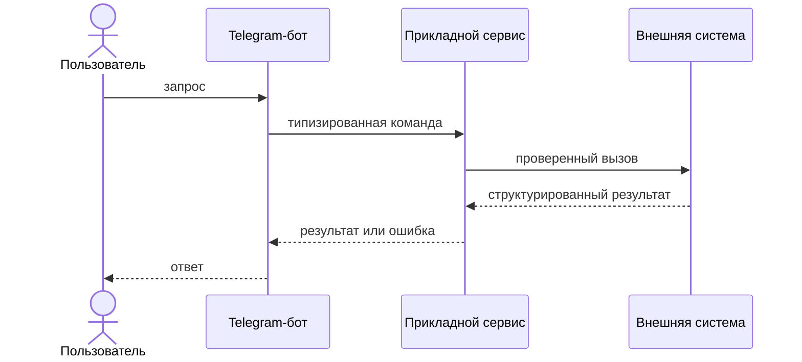

# Черновик приложений к методическим указаниям

> Внутренний черновик. Не выдавать студентам до вычитки и утверждения.

<a id="appendices"></a>

# Приложения

## Приложение А. Основные команды проекта

Все команды выполняются из корня репозитория. Команды запуска используют скрипты
шаблона: они проверяют Python, подготавливают `.venv`, устанавливают зависимости и
управляют локальным PostgreSQL.

### Проверка инструментов

Windows, PowerShell:

```powershell
py -3.12 --version
docker info
docker compose version
git --version
```

macOS или Linux:

```bash
python3.12 --version
docker info
docker compose version
git --version
```

Для выполнения работ требуется Python 3.12 и Docker Compose v2. Если команда
проверки завершается ошибкой, сначала устраните проблему с установкой инструмента,
а затем запускайте проект.

### Подготовка, запуск и управление приложением

Команды для Windows, macOS и Linux, включая подготовку окружения, запуск,
проверку состояния и остановку приложения, приведены в
[README](../README.md#2-создать-бота-и-запустить-проект).

### Тесты и статические проверки

После `--setup-only` активируйте виртуальное окружение.

Windows, PowerShell:

```powershell
.\.venv\Scripts\Activate.ps1
python -m pytest -q
python -m ruff check .
python -m ruff format --check .
python -m pip check
```

macOS или Linux:

```bash
source .venv/bin/activate
python -m pytest -q
python -m ruff check .
python -m ruff format --check .
python -m pip check
```

Полный набор выполняется перед созданием каждого лабораторного тега. Тесты с
реальными внешними API не должны входить в обычный прогон.

### Интеграционная проверка PostgreSQL

Windows, PowerShell:

```powershell
$env:RUN_INTEGRATION = '1'
python -m pytest -m integration -v
Remove-Item Env:RUN_INTEGRATION
```

macOS или Linux:

```bash
RUN_INTEGRATION=1 python -m pytest -m integration -v
```

Интеграционный тест шаблона создаёт отдельные временные Docker-ресурсы и не должен
использовать учебную базу приложения.

Интеграционные тесты лабораторных работ № 2 и № 3 помечайте тем же маркером
`integration`. Они должны проверять отсутствие дубликатов при конкурентных
операциях на реальном PostgreSQL, но использовать отдельную тестовую базу и очищать
только созданные ими данные.

### Команды новых модулей

После лабораторной работы № 2 в `README.md` должны появиться фактические команды
запуска MCP-сервера и его проверки. Рекомендуемая форма, если она соответствует
структуре проекта:

```bash
python -m app.mcp_server
```

Если выбран другой модуль, транспорт или MCP Inspector, запишите реальную команду
без многоточий и локальных абсолютных путей. После лабораторной работы № 3 аналогично
добавьте команду безопасного однократного запуска фонового обработчика в тестовом
режиме. Такой режим должен работать с управляемым источником времени или явно
выбранной тестовой записью, а не отправлять все накопленные сообщения.

### Проверка Docker Compose

```bash
docker compose config
docker compose ps
docker compose logs --tail 100 bot db
```

Команда `docker compose config` может раскрыть подставленные значения переменных.
Не копируйте её полный вывод в отчёт и публичные обращения за помощью.

### Сохранение этапов в Git

Перед фиксацией проверьте состав изменений:

```bash
git status
git diff --check
git diff
```

После успешных тестов и фиксации результата в отдельном коммите создайте
соответствующий этапу тег:

```bash
git tag -a lab1 -m "Лабораторная работа № 1"
git tag -a lab2 -m "Лабораторная работа № 2"
git tag -a lab3 -m "Лабораторная работа № 3"
```

Каждый тег создаётся один раз на соответствующем завершённом коммите. Не переносите
опубликованный тег на другой коммит; исправление оформляйте новым коммитом и явно
описывайте в `README.md`.

## Приложение Б. Шаблон отчёта

Отчёт можно подготовить в Markdown и экспортировать в PDF либо сразу оформить в
текстовом редакторе. Если для дисциплины выдан отдельный обязательный шаблон,
используйте его. В остальных случаях соблюдайте единый стиль заголовков, подписей,
таблиц и нумерации.

### Рекомендуемая структура

```text
Титульная страница
1. Цель работы
2. Условия выполнения
3. Архитектура решения
4. Реализация требований
5. Тестирование
6. Экспериментальная часть
7. Безопасность и ограничения
8. Использование AI-инструментов
9. Вывод
Список источников
Приложения к отчёту
```

На титульной странице укажите образовательную организацию, дисциплину, номер и
название работы, ФИО, учебную группу, город и год. Не размещайте токены, адрес
проживания, личный телефон и другие данные, не нужные для идентификации работы.

### Содержание разделов

**1. Цель работы.** Переформулируйте цель своими словами и перечислите проверяемые
результаты. Не копируйте весь текст задания.

**2. Условия выполнения.** Укажите версии Python, значимых библиотек, LLM-модели,
операционной системы и способ запуска. Секретные значения замените именами переменных,
например `BOT_TOKEN`.

**3. Архитектура решения.** Приведите диаграмму и кратко объясните ответственность
компонентов, направления вызовов, постоянные хранилища и внешние системы.

**4. Реализация требований.** Для каждого крупного требования укажите принятое
решение и ссылку на модуль или короткий значимый фрагмент. Полные листинги исходных
файлов в основную часть не включаются.

**5. Тестирование.** Опишите тестовое окружение и представьте результаты таблицей:

| Сценарий | Ожидаемый результат | Фактический результат | Статус |
|---|---|---|---|
| Краткое условие | Наблюдаемое поведение | Полученное поведение | пройден / не пройден |

Вывод `pytest` подтверждает общий результат, но не заменяет описание проверенных
сценариев.

**6. Экспериментальная часть.** Используйте таблицу и метрику, заданные в работе.
Сохраните условия запуска, исходный набор примеров и не удаляйте неудачные результаты.
После таблицы объясните причины различий и ограничения эксперимента.

**7. Безопасность и ограничения.** Для лабораторной работы № 1 достаточно описать
защиту секретов и истории. Для № 2 добавьте валидацию инструментов и подтверждение
действий. Для № 3 приведите матрицу полномочий, результаты сценариев проверки
безопасности и остаточные риски проактивной отправки.

**8. Использование AI-инструментов.** Используйте декларацию из приложения Г.

**9. Вывод.** Соотнесите результат с целью, назовите одно удачное инженерное решение,
одно ограничение и возможное продолжение. Формулировка «цель достигнута» без анализа
недостаточна.

### Требования к иллюстрациям и листингам

- Каждый рисунок и таблица имеют номер, название и ссылку из основного текста.
- Снимок экрана должен показывать проверяемое поведение, а не весь рабочий стол.
- Имена пользователей, chat ID, токены и другие закрытые данные скрываются до
  создания снимка, а не закрашиваются поверх опубликованного файла.
- Код приводится только в объёме, необходимом для объяснения решения.
- Текст терминала оформляется моноширинным блоком и сопровождается пояснением.
- Нельзя заменять анализ серией снимков экрана.

## Приложение В. Правила оформления диаграмм

Диаграмма должна объяснять существенное устройство или последовательность системы,
а не служить декоративной иллюстрацией. Допускаются Mermaid, PlantUML, diagrams.net
и другие средства, если результат читается в PDF.

### Какие диаграммы требуются

| Работа | Обязательная диаграмма | Что должно быть видно |
|---|---|---|
| № 1 | Диаграмма компонентов или потока данных | Telegram, handlers, сервис LLM, история, PostgreSQL |
| № 2 | Архитектура MCP и последовательность одного вызова инструмента | MCP-хост, MCP-клиент, MCP-сервер, модель, внешний API или БД |
| № 3 | Компонентная диаграмма и последовательность проактивного сценария | Router, три агента, программная политика доступа, фоновая обработка, исходящие уведомления, Telegram |

### Общие правила

1. Дайте диаграмме номер и содержательное название.
2. Показывайте фактические компоненты реализации, используя те же термины, что в
   коде и тексте отчёта.
3. Подписывайте стрелки действием или типом данных: `RouteDecision`, `tools/call`,
   SQL-запрос, Telegram message.
4. Отличайте синхронный запрос, асинхронное событие и чтение из хранилища типом
   линии или явной подписью.
5. Отмечайте внешние системы и границы доверия.
6. Показывайте PostgreSQL и другие постоянные хранилища отдельно от памяти процесса.
7. Если часть архитектуры необязательна или ещё не реализована, не изображайте её
   как работающую. Используйте отдельную диаграмму «предлагаемое развитие».
8. Добавляйте легенду, если обозначения нельзя понять без пояснений.
9. Проверяйте читаемость после экспорта в PDF при масштабе 100%.

### Что не следует помещать на диаграмму

- токены, пароли, реальные chat ID и адреса закрытых сервисов;
- полные промпты и большие фрагменты кода;
- каждый Python-файл, если он не является самостоятельным компонентом;
- неподтверждённые библиотеки и сервисы «для красоты»;
- стрелки без понятного направления и назначения.

### Минимальный пример диаграммы последовательности

Пример показывает правила оформления, а не готовую архитектуру лабораторной:



В собственной диаграмме замените обобщённые названия фактическими компонентами и
покажите проверки, существенные для конкретной лабораторной работы.

## Приложение Г. Пример декларации использования AI-инструментов

Декларация описывает вклад AI-инструментов и способы проверки результата. Она не
является перечнем каждого автодополнения и не требует публикации полных промптов.

### Шаблон

```text
ДЕКЛАРАЦИЯ ИСПОЛЬЗОВАНИЯ AI-ИНСТРУМЕНТОВ

В работе использовались следующие AI-инструменты:

1. Инструмент и модель:
2. Задача, для которой он применялся:
3. Какие данные передавались:
4. Какой результат был получен:
5. Как результат проверялся:
6. Что было изменено или отклонено:

Секреты, персональные данные и закрытые материалы в AI-сервисы не передавались.
Я проверил(а) добавленный код, понимаю принятые решения и несу ответственность
за итоговый результат.
```

Если использовалось несколько инструментов или существенно разных сценариев,
удобнее заполнить таблицу:

| Инструмент и модель | Задача | Переданные данные | Проверка | Принятое решение |
|---|---|---|---|---|
| Название и версия, если известна | Что требовалось получить | Краткое описание без секретов | Тесты, документация, ручная проверка | Принято, изменено или отклонено |

### Пример заполнения

```text
Инструмент и модель: AI-ассистент в редакторе, модель указана в настройках проекта.
Задача: сделать инструкцию локального запуска понятной для Windows и Linux.
Переданные данные: фрагмент README без .env, токенов и пользовательских данных.
Результат: предложены две команды запуска и раздел диагностики.
Проверка: команды выполнены в чистом окружении, ссылки и имена файлов сверены с
репозиторием.
Изменения: отклонён вариант с абсолютным путём автора; оставлены переносимые команды
от корня проекта.
```

### Если AI-инструменты не использовались

Укажите одной фразой: «AI-инструменты при выполнении этой лабораторной работы не
использовались». Не заполняйте вымышленную таблицу.

## Приложение Д. Устранение типовых ошибок

Сначала определите слой, на котором возникла ошибка: окружение, Telegram, база,
LLM, MCP, маршрутизация или фоновая доставка. Изменяйте по одному условию и после
каждого шага повторяйте минимальную проверку.

### Окружение и запуск

| Симптом | Вероятная причина | Что сделать |
|---|---|---|
| Python 3.12 не найден | Установлена другая версия или не обновлён PATH | Проверьте `py -3.12 --version` либо `python3.12 --version`, затем откройте новый терминал |
| Не создаётся `.venv` | Нет модуля venv или недостаточно места | Установите компонент venv для Python 3.12 и проверьте свободное место |
| Docker недоступен | Docker Desktop/Engine не запущен | Выполните `docker info`, запустите Docker и повторите команду |
| Порт PostgreSQL занят | Другой сервис использует настроенный порт | Выберите свободный `POSTGRES_PORT` в `.env` и перезапустите локальную БД |
| После изменения зависимости импорт не найден | Окружение не обновлено | Повторите `start --setup-only`, затем выполните `python -m pip check` |

Не удаляйте PostgreSQL volume или `.env` как первый способ исправления. Сначала
сохраните нужные данные и определите причину ошибки.

### Telegram

| Симптом | Вероятная причина | Что сделать |
|---|---|---|
| `Unauthorized` | Неверный или отозванный токен | Получите актуальный токен, обновите только локальный env-файл и перезапустите бота |
| `Conflict` | С тем же токеном работает второй polling-процесс | Остановите другой локальный или удалённый экземпляр |
| Бот не видит команды | Общий обработчик текста зарегистрирован раньше | Проверьте порядок регистрации роутеров и фильтры команд |
| Ответ обрезан или не отправляется | Превышен лимит сообщения | Проверьте разбиение ответа на допустимые части без потери текста |
| Проактивное сообщение не доставляется | Бот заблокирован или chat ID устарел | Зафиксируйте постоянную ошибку доставки и не повторяйте её бесконечно |

### PostgreSQL и постоянное состояние

| Симптом | Вероятная причина | Что сделать |
|---|---|---|
| Контейнер имеет статус `healthy`, приложение не подключается | Неверные реквизиты приложения | Выполните проверку состояния приложения и сверьте имена переменных без вывода пароля |
| Таблица или столбец отсутствует | Миграция не выполнена | Проверьте версию схемы и запустите документированную команду миграции |
| Данные разных пользователей смешиваются | Не проверена принадлежность данных текущему пользователю | Проверьте, что чтение и запись учитывают доверенную идентичность пользователя; добавьте тест изоляции |
| После перезапуска появились дубликаты | Повторная подготовка события не защищена | Проверьте сохраняемую идентичность задания и защиту от повторов на реальной базе |
| Запись навсегда осталась в обработке | Процесс завершился после получения задания | Проверьте восстановление незавершённых заданий после перезапуска |

### LLM и структурированные ответы

| Симптом | Вероятная причина | Что сделать |
|---|---|---|
| Ответ API `401`/`403` | Ключ отсутствует или не имеет доступа | Проверьте имя переменной и доступ в кабинете провайдера; не печатайте ключ |
| Ответ `429` | Исчерпан лимит запросов | Добавьте ограниченное ожидание, сообщите пользователю и не запускайте бесконечные повторы |
| JSON не проходит схему | Модель вернула текст или лишние поля | Проверьте поддерживаемый формат ответа и обработайте ошибку валидации |
| Модель выбирает неверный режим | Описания пересекаются или пример неоднозначен | Проверьте фиксированный набор запросов и измените одно правило инструкции |
| История переполняет контекст | Нет лимита или подсчёта объёма | Проверьте выбранную стратегию сокращения, сохраняя текущий запрос и связность передаваемой истории |

### MCP и внешние инструменты

| Симптом | Вероятная причина | Что сделать |
|---|---|---|
| Клиент не видит инструменты | Сервер не запущен, неверный транспорт или discovery завершился ошибкой | Запустите сервер отдельно, проверьте stderr и вызовите список инструментов независимым клиентом |
| `tools/call` отклоняет аргументы | Схема клиента и сервера различается | Получайте схему через discovery и валидируйте тот же объект на обеих границах |
| Погода не найдена | Город неоднозначен или геокодирование вернуло пустой список | Запросите город и страну, не подставляйте координаты самостоятельно |
| Расписание читает чужой файл | В инструмент передаётся путь пользователя | Уберите путь из схемы и задайте источник конфигурацией приложения |
| Инструмент сообщает успех после сбоя | Исключение преобразовано в обычный успешный текст | Разделите успешный результат и структурированную ошибку, проверьте status до ответа |
| Вызван запрещённый инструмент | Ограничение существует только в промпте | Проверяйте программную политику доступа непосредственно перед `tools/call` |

### Маршрутизация, фоновые задания и трассировка

| Симптом | Вероятная причина | Что сделать |
|---|---|---|
| Router вернул неизвестного агента | Цель не проверена по разрешённому списку | Отклоняйте неизвестную цель и запрашивайте уточнение |
| Сводка приходит по серверному времени | Время вычисляется без учёта часового пояса пользователя | Проверьте, что время доставки соответствует настройке пользователя независимо от зоны сервера |
| После простоя пришла серия сводок | Не настроена обработка пропущенных и объединение повторных запусков | Примените допустимое опоздание и объединение пропущенных запусков |
| Одно напоминание пришло несколько раз | Повторная подготовка события не защищена | Проверьте сохраняемый механизм защиты от повторов и остаточный риск повторной отправки Telegram |
| Уведомление не повторяется после временного сбоя | Сбой доставки ошибочно считается окончательным | Проверьте повтор после временного отказа и завершение попыток после установленного предела |
| `/trace` показывает пустой путь | Связь этапов обработки одного запроса не сохраняется | Проверьте, что этапы одного запроса связаны и видны в трассировке |
| Пользователь видит чужую трассу | Не проверена принадлежность трассы | Проверяйте доступ к трассе по доверенной идентичности пользователя; добавьте тест изоляции |

### Если проблема не найдена

Подготовьте минимальный диагностический набор:

1. точную команду, которая выполнялась;
2. версию Python и значимых библиотек;
3. полный текст ошибки без секретов;
4. минимальный сценарий воспроизведения;
5. результат `git status`;
6. сведения о том, проходит ли ближайший модульный тест;
7. безопасный идентификатор запроса или трассы, если ошибка возникла во время работы.

Не публикуйте `.env`, вывод с токенами, дамп базы, полный `docker inspect` и личные
сообщения пользователей.
